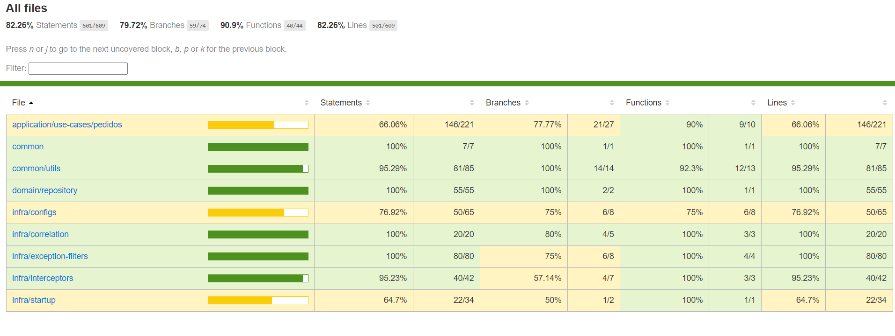

# Tech Challenge FIAP - Grupo 52

## Objetivo
API destinada ao gerenciamento de pedidos, utilizando o MongoDB como armazenamento de dados.


Responsável por operacionalizar a criação de um pedido, validando o cliente na api do monolito caso seja informado, validando as informações de itens e combos chamando a api de cardápios, somando o valor de todos os itens e combos e chamando a api de pagamentos para geraçao do QrCode.

Ao receber o status de Pago pela api de Pagamentos, fazemos uma chamada para a api de produção dar inicio a preparação do pedido realizado.

## Execução em um cluster k8s

Para executar a aplicação em um cluster Kubernetes, com o `kubectl` corretamente configurado, execute:

```shell
kubectl apply -f k8s
```

Com isso, a API estará disponível na porta 30001 do Cluster. Se for em um ambiente local com Docker Desktop ou _minikube_,
você pode acessar o endereço http://localhost:30001. Em ambientes de nuvem, substitua `localhost` pelo endereço público do cluster.

## Execução para desenvolvimento

Para executar o projeto em modo de desenvolvimento, copie o arquivo ***.env.example*** para ***.env*** e execute os seguintes comandos:

```shell
yarn install
```
```shell
yarn start:dev
```

Com isso, a API estará disponível na porta 3000 e pode ser acessada pelo endereço http://localhost:3000

## Execução em ambiente Docker

Para executar a aplicação usando Docker, basta executar o seguinte comando:

```shell
docker compose up -d
```

## Execução dos testes

Para executar os testes da aplicação, basta executar o seguinte comando:

```shell
yarn test:ci
```

Com isso, os testes irão rodar e mostra a cobertura de %.


## Documentação

A documentação da aplicação é feita usando Swagger e pode ser acessada no endereço `/swagger` da API.
Para uso em ferramentas fora do navegador, como Postman ou Insomnia, o endereço `/swagger-json` pode ser utilizado.

Sendo assim, se a aplicação estiver de pé localmente em um cluster kubernetes, via _minikube_ ou Docker Desktop, por exemplo, você pode acessar http://localhost:30001/swagger e http://localhost:30001/swagger-json .

Já se estiver utilizando Docker, pode acessar em http://localhost:3333/swagger e http://localhost:3333/swagger-json .

E se estiver utilizando o ambiente de desenvolvimento via `yarn`, basta acessar em http://localhost:3000/swagger e http://localhost:3000/swagger-json .


## OWASP ZAP
Executamos o OWASP ZAP na geração de pedido, listagem de pedido e atualização do status do pedido

Logo na primeira execução foi encontrada apenas um alerta do tipo 'Informational' que não chega nem ser um alerta de baixa prioridade, conforme relátorio abaixo.

